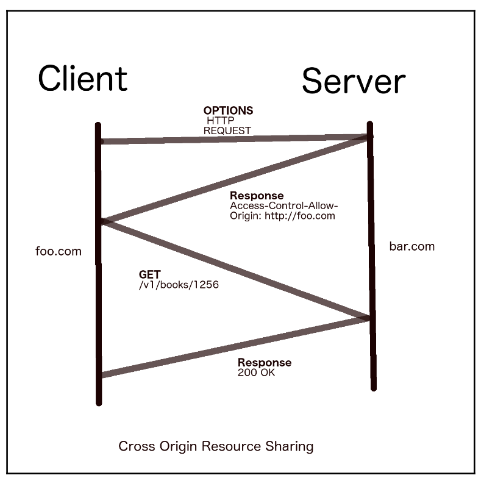
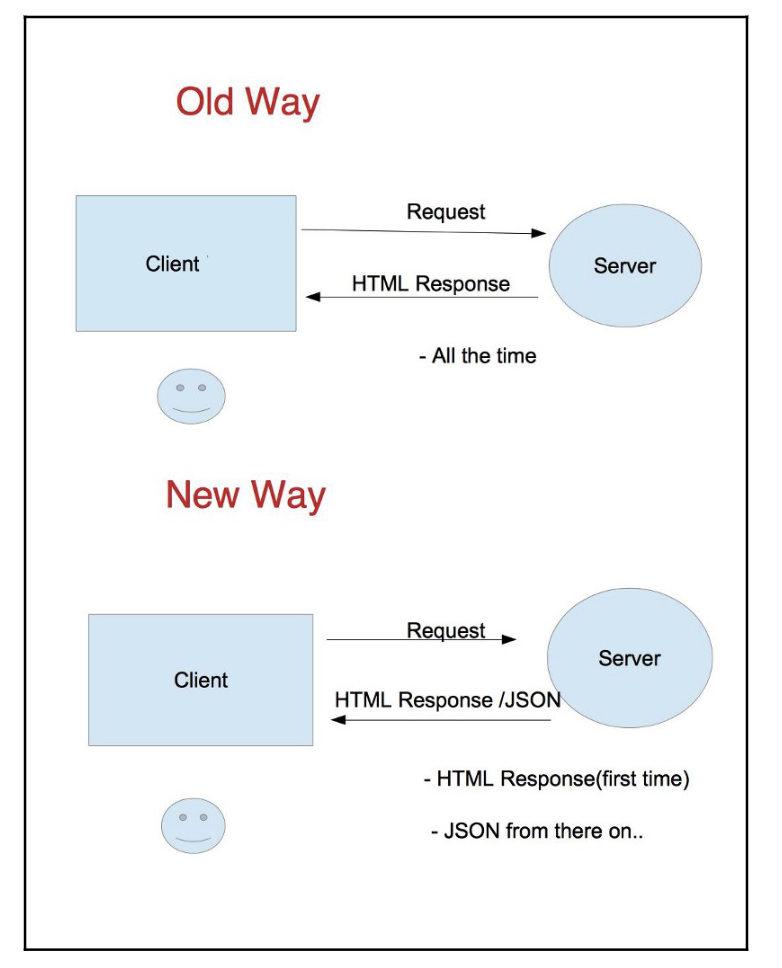

# Go ile RESTful Web Servisleri İnşa Etme - Kitap Özeti ve Notlar

## İçindekiler
1. [Bölüm 1: REST API Geliştirmeye Başlangıç](#bölüm-1-rest-api-geliştirmeye-başlangıç)
2. [Bölüm 2: Go ile RESTful API'ler Geliştirme](#bölüm-2-go-ile-restful-apiler-geliştirme)
3. [Bölüm 3: Veritabanı Entegrasyonu](#bölüm-3-veritabanı-entegrasyonu)
4. [Bölüm 4: Middleware ve Routing](#bölüm-4-middleware-ve-routing)
5. [Bölüm 5: Güvenlik ve Kimlik Doğrulama](#bölüm-5-güvenlik-ve-kimlik-doğrulama)
6. [Bölüm 6: API Dokümantasyonu](#bölüm-6-api-dokümantasyonu)
7. [Bölüm 7: Test ve Hata Ayıklama](#bölüm-7-test-ve-hata-ayıklama)
8. [Bölüm 8: Dağıtım ve Ölçeklendirme](#bölüm-8-dağıtım-ve-ölçeklendirme)
9. [Ek Kaynaklar ve Referanslar](#ek-kaynaklar-ve-referanslar)
10. [Öğrenilen Dersler ve İyi Uygulamalar](#öğrenilen-dersler-ve-iyi-uygulamalar)

---

# Bölüm 1: REST API Geliştirmeye Başlangıç

## Giriş

### RESTful API Kavramları

#### Web Servislerinin Temel Kavramları
Web servisi, farklı bilgisayar sistemleri arasında bir iletişim mekanizmasıdır. Web servisleri olmadan, sistemler arası iletişim karmaşık ve platform bağımlı hale gelir. Web, yüzlerce farklı türde iletişim protokolünü anlamak ve yorumlamak zorunda kalırdı. Bilgisayar sistemleri, web'in kolayca anlayabileceği protokollerle uyumlu olduğunda, bu büyük bir avantaj sağlar.

World Wide Web Consortium (W3C)'ye göre, web servisi "bir ağ üzerinden makineler arası etkileşimi desteklemek için tasarlanmış bir yazılım sistemidir" (https://www.w3.org/TR/ws-arch/).

Basit bir ifadeyle, web servisi iki uç nokta arasında mesajların sorunsuz aktarıldığı bir yol gibidir. Bu aktarım genellikle tek yönlüdür. İki ayrı programlanabilir varlık, kendi API'leri üzerinden iletişim kurabilir. İnsanlar dil aracılığıyla iletişim kurarken, uygulamalar API (Uygulama Programlama Arayüzü) aracılığıyla iletişim kurar.

#### Günümüz dijital dünyasında API'lerin önemi nedir? 
Nesnelerin İnterneti'nin (IoT) yükselişi, API kullanımını daha da yoğunlaştırmıştır. API farkındalığı her geçen gün artmakta ve dünya çapında her gün yüzlerce API geliştirilmekte ve belgelenmektedir. Önemli büyük işletmeler "API as a Service" (AAAS) modeline yönelmektedir. Amazon Web Services (AWS), bulut dünyasında bunun en başarılı örneklerinden biridir. Geliştiriciler, AWS tarafından sağlanan REST API'lerini kullanarak kendi uygulamalarını geliştirmektedir.


#### REST Nedir?
REST (Representational State Transfer), web servisleri için bir mimari stildir. RESTful API'ler, HTTP protokolünü kullanarak istemci ve sunucu arasında veri ve işlevselliği paylaşmak için tasarlanmıştır.

#### Web Servisleri Nedir?
Web servisi, farklı bilgisayar sistemleri arasında tanımlanmış bir iletişim mekanizmasıdır. Web servisleri olmadan, özel sistem iletişimi karmaşık ve platform bağımlı hale gelir.

World Wide Web Consortium (W3C) tanımına göre, web servisi bir ağ üzerinden makineler arası etkileşimi desteklemek için tasarlanmış bir yazılım sistemidir.

Basit bir ifadeyle, web servisi, mesajların sorunsuz aktarıldığı iki uç nokta arasındaki bir yol gibidir. İki ayrı programlanabilir varlık, kendi API'leri aracılığıyla iletişim kurabilir. İnsanlar dil aracılığıyla iletişim kurarken, uygulamalar Uygulama Programlama Arayüzü (API) aracılığıyla iletişim kurar.

#### Web Servisleri ve API Özeti
Web servisi, farklı bilgisayar sistemleri arasında tanımlanan bir iletişim mekanizmasıdır. Web servisleri olmadan, sistemler arası iletişim karmaşık ve platform bağımlı hale gelir.

W3C'nin resmi tanımına göre, web servisi "bir ağ üzerinden makineler arası etkileşimi desteklemek için tasarlanmış bir yazılım sistemidir."

Basit bir ifadeyle, web servisi iki uç nokta arasında mesajların sorunsuz aktarıldığı bir yol gibidir. İki programlanabilir varlık kendi API'leri aracılığıyla iletişim kurabilir; insanlar dil ile konuşurken, uygulamalar API (Uygulama Programlama Arayüzü) ile iletişim kurar.

Günümüz dijital dünyasında API'lerin önemi giderek artmaktadır. Nesnelerin İnterneti'nin (IoT) yükselişi, API kullanımını daha da yoğun hale getirdi. API bilinci gün geçtikçe artıyor ve her gün dünya çapında yüzlerce API geliştiriliyor ve belgeleniyor.

Önemli büyük işletmeler "API as a Service" (AAAS) modelinde gelecek görmektedir. Amazon Web Services (AWS), bulut dünyasında bunun en başarılı örneklerinden biridir. Geliştiriciler, AWS tarafından sağlanan REST API'lerini kullanarak kendi uygulamalarını yazıyor.

#### API'nin Önemi ve Geleceği
Nesnelerin İnterneti'nin (IoT) yükselişi, API kullanımını eskisinden daha yoğun hale getirdi. API bilinci gün geçtikçe artıyor ve her gün dünya çapında yüzlerce API geliştiriliyor ve belgeleniyor.

Önemli büyük işletmeler, API as a Service (AAAS) modelinde gelecek görüyor. Amazon Web Services (AWS), bulut dünyasında bunun en başarılı örneklerinden biridir. Geliştiriciler, AWS tarafından sağlanan REST API'lerini kullanarak kendi uygulamalarını yazıyor.

Seyahat siteleri gibi platformlar (örneğin Ibibo ve Expedia) gerçek zamanlı fiyatları almak için üçüncü taraf hizmetlerin API'lerini kullanmaktadır. Web servisleri kullanımı günümüzde genellikle ücretlendirilmektedir.

#### Bu Bölümde İşlenecek Konular

Bu bölümde aşağıdaki konular ele alınacaktır:

- Mevcut farklı Web Servisi türleri
- Temsili Durum Transferi (REST) mimarisinin detaylı incelemesi
- REST ile Tek Sayfa Uygulamalarına (SPA) giriş
- Go projesi kurulumu ve geliştirme sunucusunun çalıştırılması
- Roma rakamlarını bulmak için ilk servisimizin geliştirilmesi
- Go kodunu otomatik derlemek için Gulp kullanımı

#### Web Servisi Türleri

Zaman içinde gelişen birçok web servisi türü vardır. Bunlardan öne çıkanlar şunlardır:

- SOAP (Simple Object Access Protocol)
- UDDI (Universal Description, Discovery and Integration)
- WSDL (Web Services Description Language)
- REST (Representational State Transfer)

Bu türler arasında SOAP, XML'in en popüler veri formatı olduğu 2000'li yılların başında öne çıkmıştır. XML veri formatı, çeşitli dağıtık sistemlerin birbiriyle iletişim kurması için kullanılmaktaydı. Ancak SOAP'ın uygulanması oldukça karmaşıktır. SOAP'ı eleştirenler, SOAP HTTP isteklerinin ne kadar hantal olduğuna dikkat çekmektedir.

Bir SOAP isteği genellikle şu üç temel bileşenden oluşur:

1. **Zarf (Envelope)**: İsteğin dış katmanı, XML belgesini SOAP mesajı olarak tanımlar
2. **Başlık (Header)**: İsteğe bağlı bileşen, kimlik doğrulama gibi ek bilgileri içerir
3. **Gövde (Body)**: İstekle ilgili asıl bilgileri içeren zorunlu bileşen

Basit bir HTTP istek-yanıt döngüsü gerçekleştirmek için bile SOAP'ta çok fazla ek veri eklemek zorunda kalırız. Aşağıda W3C standardına uygun bir SOAP isteği örneği verilmiştir:

```xml
POST /StockQuote HTTP/1.1
Host: www.stockquoteserver.com
Content-Type: text/xml; charset="utf-8"
Content-Length: nnnn
SOAPAction: "Some-URI"

<SOAP-ENV:Envelope
  xmlns:SOAP-ENV="http://schemas.xmlsoap.org/soap/envelope/"
  SOAP-ENV:encodingStyle="http://schemas.xmlsoap.org/soap/encoding/">
   <SOAP-ENV:Body>
       <m:GetLastTradePrice xmlns:m="Some-URI">
           <symbol>DIS</symbol>
       </m:GetLastTradePrice>
   </SOAP-ENV:Body>
</SOAP-ENV:Envelope>
```

Bu örnekte dikkat edilirse, XML formatının kullanıldığı ve zarf, gövde gibi özel etiketlerin yer aldığı görülmektedir. XML, birçok isim alanı (namespace) gerektirdiğinden, iletişimin sağlanabilmesi için çok fazla ek bilgi eklenmesi gerekir. Bu karmaşıklık, REST gibi daha basit yaklaşımların geliştirilmesine neden olmuştur.

#### REST API Tanımı ve Özellikleri

Temsili Durum Transferi (Representational State Transfer - REST) terimi, California Üniversitesi'nden Roy Fielding tarafından ortaya atılmıştır. SOAP'a kıyasla çok daha basitleştirilmiş ve hafif bir web servisidir. Performans, ölçeklenebilirlik, basitlik, taşınabilirlik ve değiştirilebilirlik, REST tasarımının arkasındaki temel ilkelerdir.

REST API, farklı sistemlerin çok basit bir şekilde iletişim kurmasına ve veri göndermesine/almasına olanak tanır. Her REST API çağrısı, bir HTTP fiili (GET, POST, PUT, DELETE gibi) ile URL arasında bir ilişkiye sahiptir. Bir uygulamanın veritabanındaki kaynaklar, REST'te bir API uç noktasıyla (endpoint) eşleştirilebilir.

Telefonunuzda bir mobil uygulama kullanırken, cihazınız arka planda verilerinizi almak, güncellemek veya silmek için gizlice birçok bulut hizmetiyle iletişim kuruyor olabilir. REST servisleri, günlük hayatımızda büyük bir etkiye sahiptir.

REST; durumsuz (stateless), önbelleğe alınabilir (cacheable) ve basit bir mimaridir. Bir protokol değil, bir mimari desen (pattern) olarak kabul edilir.

#### REST Servislerinin Temel Özellikleri

REST'i önceki web servislerine göre benzersiz ve basit kılan temel özellikler şunlardır:

1. **İstemci-sunucu mimarisi**: Bu mimari, modern web'in HTTP üzerinden iletişim kurması için esastır. Tek bir istemci-sunucu modeli başlangıçta basit görünebilir, ancak birçok hibrit mimari gelişmektedir. Bu mimari, istemci ve sunucu taraflarının bağımsız gelişimini mümkün kılar.

2. **Durumsuzluk (Statelessness)**: REST servislerinin en önemli özelliğidir. Bir REST HTTP isteği, sunucunun yanıtı anlaması ve geri vermesi için gereken tüm verileri içerir. Bir istek tamamlandıktan sonra, sunucu bu isteğin bir süre sonra gelip gelmediğini hatırlamaz. Bu şekilde her işlem durumsuz olur, bu da ölçeklenebilirliği artırır.

3. **Önbelleğe alınabilirlik (Cacheability)**: Birçok geliştirici, teknoloji yığınının web uygulamalarını veya API'lerini yavaşlattığını düşünür. Ancak gerçekte, mimarileri bunun nedenidir. Veritabanı, bir web uygulamasında performans iyileştirme noktası olabilir. Bir uygulamayı iyi ölçeklendirmek için içeriği önbelleğe alıp yanıt olarak sunmamız gerekir. Önbellek geçerli değilse, onu geçersiz kılmak bizim sorumluluğumuzdur. REST servisleri, ölçeklendirme için uygun şekilde önbelleğe alınmalıdır.

4. **İstek üzerine kod çalıştırma (Scripts on demand)**: JavaScript dosyalarını sunan ve anında çalıştıran bir REST servisi tasarladınız mı hiç? Bu "talep üzerine kod" özelliği, REST'in sağlayabileceği temel özelliklerden biridir. Sunucudan komut dosyaları ve veri istemek yaygın bir uygulamadır.

5. **Çok katmanlı sistem (Multiple layered system)**: REST API birden fazla sunucudan sunulabilir. Bir sunucu diğerinden istekte bulunabilir ve bu şekilde devam edebilir. Yani istemciden bir istek geldiğinde, istek ve yanıt, sonunda istemciye bir yanıt vermek için birçok sunucu arasında geçebilir. Bu kolay uygulanabilir çok katmanlı sistem, web uygulamasını gevşek bağlı (loosely coupled) tutmak için her zaman iyi bir stratejidir.

6. **Kaynakların temsili (Representation of resources)**: REST API, iletişim kurmak için tekdüzen bir arayüz sağlar. Kaynaklara (verilere) erişmek için URI (Uniform Resource Identifier) kullanır. Ayrıca yanıt olarak belirli bir veri formatı isteme avantajına sahiptir. İnternet Medya Türü (MIME türü), sunucuya istenen kaynağın belirli bir türde olduğunu söyleyebilir.

7. **Uygulama özgürlüğü (Implementational freedom)**: REST, yalnızca web servislerinizi tanımlamak için bir mekanizmadır. Birden çok şekilde uygulanabilen mimari bir stildir. Bu esneklik sayesinde, REST servislerini istediğiniz şekilde oluşturabilirsiniz. REST prensiplerini takip ettiği sürece, sunucunuz platform veya teknoloji seçme özgürlüğüne sahiptir.

REST servislerinin bu özellikleri, onu modern web uygulamaları için ideal bir seçim haline getirir. Ölçeklenebilirlik ve esneklik sunarken, sistemler arası iletişimi basitleştirir.

> **Önemli Not**: REST servislerinin ölçeklenebilmesi için dikkatli önbellek yönetimi şarttır. İyi tasarlanmış bir önbellek stratejisi, performansı artırır, sunucu yükünü azaltır ve kullanıcı deneyimini iyileştirir.

#### REST Fiilleri ve Durum Kodları

REST fiilleri (HTTP metodları), belirli bir kaynak veya kaynak koleksiyonu üzerinde gerçekleştirilecek bir eylemi belirtir. İstemci tarafından bir istek yapıldığında, HTTP isteğinde şu bilgileri göndermelidir:

- REST fiili (HTTP metodu)
- Başlık bilgileri (Header)
- Gövde (Body, isteğe bağlı)

REST, işleyeceği kaynağı anlamak için URI'yi kullanır. Birkaç REST fiili vardır, ancak altı tanesi sıklıkla kullanılır:

1. **GET**: Sunucudan bir kayıt veya kaynak kümesi getirir
2. **POST**: Yeni bir kaynak veya kaynak kümesi oluşturur
3. **PUT**: Verilen kaydı günceller veya değiştirir
4. **PATCH**: Verilen kaydı değiştirir (kısmi güncelleme)
5. **DELETE**: Verilen kaynağı siler
6. **OPTIONS**: Mevcut tüm REST işlemlerini getirir

Yazılım geliştiricisi olarak, çoğu zaman bu altı fiil ile çalışacaksınız. Aşağıdaki tablo, her HTTP metodunun işlemini, hedef kaynağını ve isteğin başarılı veya başarısız olması durumunda ne olacağını açıklar:

| REST Fiili | İşlem | Başarı | Başarısızlık |
|------------|-------|--------|-------------|
| GET | Sunucudan kayıt veya kaynak kümesi getirir | 200 | 404 |
| OPTIONS | Mevcut tüm REST işlemlerini getirir | 200 | - |
| POST | Yeni bir kaynak veya kaynak kümesi oluşturur | 201 | 404, 409 |
| PUT | Verilen kaydı günceller veya değiştirir | 200, 204 | 404 |
| PATCH | Verilen kaydı değiştirir | 200, 204 | 404 |
| DELETE | Verilen kaynağı siler | 200 | 404 |

"Başarı" ve "Başarısızlık" sütunlarındaki sayılar HTTP durum kodlarıdır. Bir istemci bir REST işlemi başlattığında, REST durumsuz olduğundan, istemci işlemin başarılı olup olmadığını anlayacak bir yol bilmelidir. Bu nedenle, HTTP yanıt için durum kodlarına sahiptir. REST, belirli bir işlem için yukarıdaki durum kodu türlerini tanımlar. Bu, istemci-sunucu iletişimini sağlamak için REST API'nin yukarıdaki kurallara sıkı bir şekilde uyması gerektiği anlamına gelir.

#### REST API URI Yapısı

Temel bir REST API URI yapısı: `http://HostName/API-endpoint/Query(isteğe bağlı)`

REST API tasarımı, işlemlerin ve API uç noktalarının tanımlanmasıyla başlar. API'yi uygulamadan önce, tasarım belgesi verilen kaynaklar için tüm uç noktaları listelemelidir. Bir sonraki bölümde, PayPal'ın REST API'sini bir kullanım örneği olarak inceleyerek REST API uç noktalarını daha yakından göreceğiz.

#### GET Metodu ve Parametre Türleri

GET metodu, sunucudan belirtilen kaynağı getiren HTTP metodudur. Bir kaynağı belirtmek için GET, birkaç tür URI sorgusu kullanır:

- Sorgu parametreleri (Query parameters)
- Yol tabanlı parametreler (Path-based parameters)

Web'de gezinirken yaptığınız tüm işlemler aslında sunucuya GET isteği yapmaktır. Örneğin, www.google.com yazarsanız, aslında arama sayfasını getirmek için bir GET isteği yapıyorsunuz. Burada tarayıcınız istemci, Google'ın web sunucusu ise web servislerinin backend uygulayıcısıdır. Başarılı bir GET işlemi 200 durum kodu döndürür.

##### Yol Parametreleri Örnekleri

PayPal'ın faturalandırma anlaşması bilgilerini almak için örnek bir GET isteği şöyle görünür: `/v1/payments/billing-agreements/agreement_id`

Burada kaynak sorgusu yol parametresi ile yapılır. Sunucu bu satırı gördüğünde, "faturalandırma anlaşmalarından agreement_id'ye ihtiyacı olan bir HTTP isteği aldım" şeklinde yorumlar. Ardından veritabanında arama yapar, faturalandırma anlaşmaları tablosuna gider ve verilen agreement_id ile bir anlaşma bulur. Bu kaynak mevcutsa, ayrıntıları yanıtta gönderir (200 OK). Aksi takdirde, kaynak bulunamadı (404) diyen bir yanıt gönderir.

GET kullanarak, yukarıdaki örnekteki gibi tek bir kaynak yerine bir kaynak listesi de sorgulayabilirsiniz. Bir anlaşmayla ilgili faturalandırma işlemlerini almak için PayPal'ın API'si şu şekilde kullanılabilir: `/v1/payments/billing-agreements/transactions`. Bu satır, bu faturalandırma anlaşmasında gerçekleşen tüm işlemleri getirir.

##### Sorgu Parametreleri Örnekleri

Sorgu parametreleri, sunucudan bir kaynağı tanımlamak için ayrıntılı bilgi eklemek için kullanılır. Örneğin, bu örnek hayali API'yi ele alalım. Bu API'nin kitapların ayrıntılarını getirmek, oluşturmak ve güncellemek için oluşturulduğunu varsayalım. Sorgu parametresi tabanlı bir GET isteği şu formatta olacaktır:

`/v1/books/?category=fiction&publish_date=2017`

Bu URI'nin birkaç sorgu parametresi vardır. URI, aşağıdaki koşulları sağlayan kitaplar kaynağından bir kitap istemektedir:
- Kurgu kitabı olmalı
- Kitap 2017 yılında yayınlanmış olmalı

"2017 yılında yayınlanan tüm kurgu kitaplarını al" sorusunu istemci sunucuya soruyor.

##### Yol ve Sorgu Parametreleri - Ne Zaman Kullanılmalı?

Sorgu parametrelerinin, sorgu parametrelerine göre birden fazla kaynak getirmek için kullanıldığı yaygın bir kuraldır. Bir istemci tam URI bilgisiyle tek bir kaynağa ihtiyaç duyuyorsa, kaynağı belirtmek için Yol parametrelerini kullanabilir. Örneğin, bir kullanıcı kontrol paneli Yol parametreleri ile istenebilir ve filtreleme hakkında veri getirme Sorgu parametreleri ile modellenebilir.

> **İpucu**: GET isteğinde tek bir kaynak için Yol parametrelerini, birden fazla kaynak için Sorgu parametrelerini kullanın.

#### POST, PUT ve PATCH Metodları

##### POST Metodu

POST metodu, sunucuda yeni bir kaynak oluşturmak için kullanılır. Örneğin, kitap API'sinde bu işlem verilen ayrıntılarla yeni bir kitap kaydı oluşturur. Başarılı bir POST işlemi 201 durum kodunu döndürür. POST isteği şu şekilde birden çok kaynak oluşturabilir: `/v1/books`.

POST isteğinin gövdesi şuna benzer bir JSON formatında olur:
```json
{"name": "Lord of the rings", "year": 1954, "author": "J. R. R. Tolkien"}
```

Bu istek veritabanında yeni bir kitap kaydı oluşturur. Bu kayda bir ID atanır, böylece daha sonra GET ile kaynağı çağırdığımızda ilgili URL oluşturulmuş olur. Bu nedenle POST işlemi sadece bir kez, başlangıçta yapılmalıdır.

Örneğin, "Yüzüklerin Efendisi" aslında 1955 yılında yayımlanmıştır, bu durumda yayınlanma tarihini yanlış girmiş oluruz. Kaynağı güncellemek için PUT isteğini kullanabiliriz.

##### PUT Metodu

PUT metodu POST'a benzer, ancak zaten var olan bir kaynağı değiştirmek için kullanılır. Temel fark, PUT'un idempotent olmasıdır. Yani, aynı PUT isteği birden fazla kez yapılsa bile sonuç değişmez. Oysa aynı POST isteği birden fazla kez yapıldığında her seferinde yeni bir kaynak oluşturulur.

PUT, var olan tek bir kaynağı güncellemek için kullanılır:
```
/v1/books/1256
```

JSON gövdesi şu şekilde olabilir:
```json
{"name": "Lord of the rings", "year": 1955, "author": "J. R. R. Tolkien"}
```

Burada "1256", kitabın ID'sidir. Bu istek, yukarıdaki kitabı year:1955 olarak günceller.

PUT metodunun bir dezavantajı vardır: Eski kaydın tamamını yeni versiyon ile değiştirir. Sadece tek bir alanı (örneğin yayın yılını) değiştirmek istediğimizde bile tüm kaydı göndermemiz gerekir. PUT işlemi tüm kaydı değiştirir, bu da bazı durumlarda verimsiz olabilir. Bu sorunu çözmek için PATCH metodu tanıtılmıştır.

##### PATCH Metodu

PATCH metodu PUT'a benzer, ancak tüm kaydı değiştirmez. PATCH, adından da anlaşılacağı gibi, sadece değiştirilmek istenen alanları günceller. 

Örneğin, ID'si 1256 olan kitaba yeni bir ISBN alanı eklemek için:
```
/v1/books/1256
```

JSON gövdesi şu şekilde olabilir:
```json
{"isbn": "0618640150"}
```

Bu istek sunucuya şunu söyler: "ID'si 1256 olan kitabı bul. Sonra bu ISBN alanını verilen değerle ekle veya değiştir."

> PUT ve PATCH metodları, başarılı işlem için 200 durum kodunu, kaynak bulunamadığında ise 404 durum kodunu döndürür.

##### DELETE Metodu

DELETE metodu, veritabanından bir kaynağı silmek için kullanılır. PUT metoduna benzer, ancak herhangi bir gövde içermez. Sadece silinecek kaynağın ID'sine ihtiyaç duyar. Bir kaynak silindikten sonra, bu kaynağa yapılan GET istekleri 404 (bulunamadı) durum kodu döndürür.

DELETE isteği şu şekilde olabilir:
```
/v1/books/1256
```

Bu istek, ID'si 1256 olan kitabı siler. DELETE metodu idempotent olduğu için (yani aynı istek birden fazla kez yapılsa bile sonuç değişmez), bu metoda verilen yanıtlar önbelleğe alınmaz. Yani önbellekleme uygulanmış olsa bile, DELETE isteğinden dönen yanıtlar önbelleğe kaydedilmez.

##### OPTIONS Metodu

OPTIONS metodu, API geliştirmede en az değer verilen metodlardan biridir. Belirli bir kaynak için sunucuda tanımlanmış tüm olası metodları (GET, POST vb.) öğrenmek için kullanılır. 

Bu metod, bir restoranda menü kartına bakıp mevcut olan bir yemeği sipariş etmeye benzer (rastgele bir yemek sipariş ederseniz, garson size bunun mevcut olmadığını söyleyecektir). Sunucuda OPTIONS metodunu uygulamak en iyi uygulamadır. İstemci tarafında, önce OPTIONS metodunu çağırmak ve eğer istenen metod mevcutsa, o zaman ilgili metodu kullanmaya devam etmek daha doğrudur.

OPTIONS isteği şu şekilde olabilir:
```
/v1/books/1256
```

Bu istek, "/v1/books/1256" kaynağı üzerinde hangi HTTP metodlarının (GET, POST, PUT, DELETE vb.) kullanılabileceğini döndürür. Sunucu genellikle "Allow" başlığında izin verilen metodları listeleyerek yanıt verir.

#### Cross-Origin Resource Sharing (CORS)

Cross-Origin Resource Sharing (CORS), OPTIONS metodunun en önemli uygulamalarından biridir. Başlangıçta, tarayıcı güvenliği istemcinin farklı kaynaklardan (cross-origin) istekte bulunmasını engelliyordu. Bu, www.foo.com URL'si ile yüklenen bir sitenin yalnızca o sunucuya (foo.com) API çağrıları yapabileceği anlamına gelir. İstemci kodu www.bar.com'dan dosya veya veri talep etmek istiyorsa, ikinci sunucu olan bar.com'un foo.com'u tanıyarak kaynaklarına erişmesine izin verecek bir mekanizmaya sahip olması gerekir.

CORS süreci şu şekilde açıklanabilir:

1. foo.com, bar.com üzerinde OPTIONS metodu ile bir istek gönderir.
2. bar.com, istemciye yanıt olarak `Access-Control-Allow-Origin: http://foo.com` gibi bir başlık gönderir.
3. Bundan sonra, foo.com herhangi bir kısıtlama olmadan bar.com'daki kaynaklara erişebilir ve herhangi bir REST metodunu çağırabilir.

Eğer bar.com, başlangıçtaki bu istekten sonra kaynaklarını herhangi bir sunucuya sağlamak istiyorsa, Access Control başlığını * (yani herhangi biri) olarak ayarlayabilir.

Aşağıdaki diyagram, bu işlemlerin birbirini takip eden adımlarını göstermektedir:



Bu diyagram, istemci (foo.com) ve sunucu (bar.com) arasındaki CORS iletişimini göstermektedir. İlk olarak istemci, OPTIONS isteği ile sunucunun CORS politikasını sorgular. Sunucu, Access-Control-Allow-Origin başlığı ile foo.com'un erişimine izin verdiğini belirtir. Bundan sonra istemci, GET isteği ile kaynaklara erişebilir ve sunucu 200 OK yanıtı ile başarılı bir şekilde yanıt verir.

#### Durum Kodlarının Türleri

Birkaç durum kodu ailesi bulunmaktadır. Her aile, genel olarak bir işlemin durumunu açıklar. Bu ailenin her üyesi daha derin bir anlama sahip olabilir. Bu nedenle, bir REST API işlem sonrasında istemciye tam olarak ne olduğunu kesin bir şekilde bildirmelidir. 60'tan fazla durum kodu mevcuttur, ancak REST için birkaç kod ailesi üzerinde yoğunlaşırız.

1. **1xx (Bilgilendirici)**: İstek alındı ve işlem devam ediyor.
   - Örnek: 100 Continue - İstemci isteğine devam etmelidir.

2. **2xx (Başarılı)**: İstek başarıyla alındı, anlaşıldı ve kabul edildi.
   - Örnek: 200 OK - İşlem başarılı.
   - Örnek: 201 Created - Yeni bir kaynak oluşturuldu.
   - Örnek: 204 No Content - İsteğe başarıyla yanıt verildi, ancak geri gönderilecek içerik yok.

3. **3xx (Yönlendirme)**: İsteğin tamamlanması için daha fazla işlem yapılması gerekiyor.
   - Örnek: 301 Moved Permanently - İstenen kaynak kalıcı olarak başka bir URI'ye taşındı.
   - Örnek: 304 Not Modified - İstemci önbelleğindeki kaynak güncel.

4. **4xx (İstemci Hatası)**: İstek hatalı sözdizimi içeriyor ve yerine getirilemez.
   - Örnek: 400 Bad Request - Sunucu isteği anlayamadı.
   - Örnek: 401 Unauthorized - Kimlik doğrulama gerekli.
   - Örnek: 403 Forbidden - Sunucu isteği anladı, ancak reddediyor.
   - Örnek: 404 Not Found - İstek URI'si ile eşleşen kaynak bulunamadı.

5. **5xx (Sunucu Hatası)**: Sunucu, görünüşte geçerli bir isteği yerine getirme konusunda başarısız oldu.
   - Örnek: 500 Internal Server Error - Sunucuda bir şeyler yanlış gitti.
   - Örnek: 503 Service Unavailable - Sunucu şu anda isteği işleyemiyor.

REST API'yi kullanırken, işlemlerin başarısını veya başarısızlığını belirten uygun durum kodlarını kullanmak çok önemlidir. Doğru durum kodları, istemci ve sunucu arasındaki iletişimi kolaylaştırır ve hata ayıklama sürecini basitleştirir.

##### 2xx Ailesi (Başarılı)

200 ve 201 başarı ailesine girer. Bu kodlar, bir işlemin başarılı olduğunu gösterir:

- **200 (Başarılı İşlem)**: REST'te en yaygın yanıt durum kodudur. Başarılı bir CRUD işlemini gösterir.
- **201 (Başarıyla Oluşturuldu)**: Bir POST işlemi sunucuda başarıyla bir kaynak oluşturduğunda döndürülür.
- **204 (İçerik Yok)**: İstemci bir durum bilgisi istediğinde ancak herhangi bir veri dönüşü gerekmediğinde yayınlanır.

##### 3xx Ailesi (Yönlendirme)

Bu durum kodları, yönlendirme mesajlarını iletmek için kullanılır. En önemlileri 301 ve 304'tür:

- **301 (Kalıcı Olarak Taşındı)**: Bir kaynak kalıcı olarak başka bir URL uç noktasına taşındığında yayınlanır. Eski bir API kullanımdan kaldırıldığında önemlidir. Yanıtta 301 durumuyla birlikte yeni uç noktayı döndürür. Bunu gören istemci, hedefine ulaşmak için yanıttaki yeni URL'yi kullanmalıdır.
- **304 (Değiştirilmedi)**: İçeriğin önbelleğe alındığını ve sunucudaki kaynak için herhangi bir değişiklik olmadığını gösterir. Bu, istemcide içeriğin önbelleğe alınmasına ve yalnızca önbellek değiştirildiğinde veri talep edilmesine yardımcı olur.

##### 4xx Ailesi (İstemci Hatası)

Bunlar, istemcinin yorumlayıp daha fazla eylem gerçekleştirmesi gereken standart hata durum kodlarıdır. Bu hatalar sunucuyla ilgili değildir. Yanlış istek formatı veya hatalı oluşturulmuş REST yöntemi bu hataları neden olabilir. API geliştiricilerin en sık kullandığı durum kodları 400, 401, 403, 404 ve 405'tir:

- **400 (Hatalı İstek)**: Sunucu istemci isteğini anlayamadığında döndürülür.
- **401 (Yetkisiz)**: İstemci, başlıkta yetkilendirme bilgisini göndermediğinde döndürülür.
- **403 (Yasaklandı)**: İstemcinin belirli bir kaynak türüne erişimi olmadığında döndürülür.
- **404 (Bulunamadı)**: İstemci, var olmayan bir kaynak üzerinde istek yaptığında döndürülür.
- **405 (Metod İzin Verilmedi)**: Sunucu, kaynaklar üzerinde bazı metodları yasaklamışsa döndürülür. GET ve HEAD istisnadır.

##### 5xx Ailesi (Sunucu Hatası)

Bunlar sunucudan kaynaklanan hatalardır. İstemci isteği mükemmel olabilir, ancak sunucu kodundaki bir hata nedeniyle bu hatalar ortaya çıkabilir. Yaygın olarak kullanılan durum kodları 500, 501, 502, 503 ve 504'tür:

- **500 (İç Sunucu Hatası)**: Hatalı kod veya beklenmeyen bir durum nedeniyle oluşan geliştirme hatasını bildirir.
- **501 (Uygulanmadı)**: Sunucu bir kaynak üzerindeki yöntemi artık desteklemediğinde döndürülür.
- **502 (Hatalı Ağ Geçidi)**: Sunucunun kendisi başka bir servis sağlayıcısından hata yanıtı aldığında döndürülür.
- **503 (Hizmet Kullanılamıyor)**: Sunucu, yoğun yük veya bakım gibi çeşitli nedenlerden dolayı çalışmadığında döndürülür.
- **504 (Ağ Geçidi Zaman Aşımı)**: Sunucu, başka bir sağlayıcıdan yanıt beklerken uzun süre beklediğinde ve istemciye hizmet vermek için çok fazla zaman aldığında döndürülür.

Durum kodları hakkında daha fazla bilgi için şu bağlantıyı ziyaret edebilirsiniz: [Mozilla HTTP Durum Kodları](https://developer.mozilla.org/en-US/docs/Web/HTTP/Status)

#### REST API ile Tek Sayfa Uygulamalarının Yükselişi


Günümüzde Tek Sayfa Uygulamalarının (SPA) neden bu kadar popüler olduğunu anlamanız gerekir. Geleneksel yöntemle (web sayfaları isteme) kullanıcı arayüzü oluşturmak yerine, bu SPA tasarımları geliştiricilerin kodu tamamen farklı bir şekilde yazmasını sağlar. 

Web kullanıcı arayüzlerini hızlı bir şekilde geliştirmek için AngularJS, Angular2, React JS, Knockout JS, Aurelia gibi birçok MVC çerçevesi vardır, ancak bunların her birinin özü oldukça basittir. Tüm MVC çerçeveleri, bir tasarım desenini uygulamamıza yardımcı olur. Bu tasarım deseni "Web sayfaları isteme, sadece REST API kullan" şeklindedir.

Modern web ön yüz geliştirme dünyası 2010 yılından bu yana büyük ilerleme kaydetmiştir. Model-View-Controller (MVC) mimarisinin özelliklerinden yararlanmak için, ön yüzü backend ile sadece REST API (tercihen REST JSON) üzerinden iletişim kuran ayrı bir varlık olarak düşünmemiz gerekir.

Geleneksel web uygulamalarında, istemci (tarayıcı) sunucudan HTML sayfaları ister ve sunucu bu sayfaları oluşturup gönderir. Her sayfa değişikliğinde, tüm sayfa yeniden yüklenir. SPA yaklaşımında ise, tarayıcı başlangıçta tek bir HTML sayfası yükler ve daha sonraki tüm etkileşimler JavaScript aracılığıyla REST API çağrıları kullanılarak gerçekleştirilir. Bu, sayfa yenilemesi olmadan daha akıcı bir kullanıcı deneyimi sağlar.

Bu mimari ayrım, ön yüz ve arka yüz geliştirme ekiplerinin bağımsız çalışabilmesine olanak tanır. Backend ekibi REST API'yi tasarlar ve uygularken, frontend ekibi kullanıcı arayüzünü geliştirir. İki ekip, API'nin belirlediği sözleşmeyi takip ettiği sürece sorunsuz entegrasyon sağlanır.

SPA'lar, çeşitli avantajlar sunar:
- Daha hızlı ve daha duyarlı kullanıcı deneyimi
- Sadece gereken verilerin sunucudan alınması
- Frontend ve backend geliştirmenin ayrılması
- Mobil uygulama gibi deneyim sunma yeteneği
- Backend API'lerinin yeniden kullanılabilirliği (web, mobil ve diğer istemciler için)

Ancak, SPA'lar bazı zorluklar da getirir:
- Arama motoru optimizasyonu (SEO) sorunları (çözülebilir)
- İlk yükleme süresi daha uzun olabilir
- JavaScript'in etkin olması gerekliliği
- Daha karmaşık durum yönetimi

REST API ve SPA kombinasyonu, modern web uygulamalarının temelini oluşturur ve geliştirici topluluğu tarafından geniş çapta benimsenmiştir.

#### SPA'larda Veri Akışının Eski ve Yeni Yöntemleri

Tüm web siteleri geleneksel olarak aşağıdaki adımlardan geçer:

1. Sunucudan bir web sayfası iste.
2. Kimlik doğrulaması yap ve Kontrol Paneli (Dashboard) kullanıcı arayüzünü göster.
3. Kullanıcının içeriği değiştirmesine ve kaydetmesine izin ver.
4. Sitedeki bireysel sayfaları göstermek için sunucudan gerektiği kadar web sayfası iste.

Ancak Tek Sayfa Uygulamalarında (SPA) akış oldukça farklıdır:

1. HTML şablonunu/şablonlarını tek seferde tarayıcıya iste.
2. Ardından, bir model (veri nesnesi) doldurmak için JSON REST API'sini sorgula.
3. Modeldeki (JSON) verilere göre kullanıcı arayüzünü düzenle.
4. Kullanıcılar kullanıcı arayüzünü değiştirdiğinde, model (veri nesnesi) otomatik olarak değişmelidir. Örneğin, AngularJS'de bu çift yönlü veri bağlama (two-way data binding) ile mümkündür. Son olarak, değişiklikleri sunucuya bildirmek için istediğiniz zaman REST API çağrıları yap.



Bu şekilde, iletişim yalnızca REST API biçiminde gerçekleşir. İstemci, verileri mantıksal olarak temsil etme görevini üstlenir. Bu durum, sistemlerin Yanıt Odaklı Mimariden (Response Oriented Architecture - ROA) Servis Odaklı Mimariye (Service Oriented Architecture - SOA) geçmesine neden olur.

Bu mimari değişim, web uygulamalarının geliştirme, bakım ve ölçeklendirme süreçlerini büyük ölçüde etkilemiştir. SPA modelinde sunucu tarafı, verileri ve iş mantığını sağlamakla görevli olurken, istemci tarafı kullanıcı deneyimini ve veri sunumunu yönetir. Bu ayrım, hem frontend hem de backend geliştiricilerinin kendi uzmanlık alanlarında daha etkili çalışmalarına olanak tanır.

---

### Go Neden REST API Geliştirmesi İçin Tercih Edilir?


Modern web dünyasında REST servisleri artık sıradan bir hale gelmiştir. SOA (Servis Odaklı Mimari - daha sonra detaylı olarak ele alacağız), web geliştirmeyi bir sonraki seviyeye taşımak için REST servislerine bir faaliyet alanı oluşturdu. Go, Google'ın karşılaştığı daha büyük problemleri çözmek için geliştirdiği bir programlama dilidir. İlk ortaya çıkışından bu yana sekiz yıldan fazla bir süre geçti. Bu süre içinde olgunlaştı ve geliştirici topluluğunun katılımıyla büyük ölçekli sistemler oluşturuldu.

Go, web'in gözdesidir. Büyük problemleri kolay bir şekilde çözer.

REST API geliştirmek için Python veya JavaScript (Node) tercih edilebilir. Go'nun temel avantajı, hızı ve derleme zamanında hata tespiti yapabilmesidir. Çeşitli karşılaştırmalı testlerde Go'nun, hesaplama performansı açısından dinamik programlama dillerinden daha hızlı olduğu kanıtlanmıştır. Bir şirketin bir sonraki API'sini Go ile yazması için üç neden şunlardır:

1. API'nizi daha geniş bir kitle için ölçeklendirmek
2. Geliştiricilerinizin sağlam sistemler oluşturmasını sağlamak
3. Projelerinizin gelecekteki uygulanabilirliğine yatırım yapmak

Go ile REST servisleri hakkında daha fazla bilgi için internetteki bitmeyen tartışmalara göz atabilirsiniz. Sonraki bölümlerde, REST servislerini tasarlama ve yazmanın temellerini oluşturmaya çalışacağız.

### Proje Kurulumu ve Geliştirme Sunucusunun Çalıştırılması

Bu kitap, adım adım uygulama geliştirmeye dayalıdır. Temel Go bilgisine sahip olduğunuzu varsayar. Eğer bilmiyorsanız endişelenmeyin. Go'nun resmi sitesinden (https://golang.org/) hızlı bir şekilde öğrenmeye başlayabilirsiniz. Go, projeleri geliştirmek için farklı bir yaklaşım kullanır. Basit, bağımsız bir program yazmak sizi çok zorlamaz. Ancak temelleri öğrendikten sonra, insanlar bir adım daha ilerlemeye çalışır. Bu nedenle, bir Go geliştiricisi olarak, Go projelerinin nasıl düzenlendiğini ve kodunuzu temiz tutmak için en iyi uygulamaları bilmeniz gerekir.

Devam etmeden önce aşağıdaki adımları tamamladığınızdan emin olun:

1. Makinenize Go derleyicisini kurun
2. GOROOT ve GOPATH ortam değişkenlerini ayarlayın

Bu detayları öğrenmek için çeşitli çevrimiçi kaynaklar bulunmaktadır. Makine türünüze bağlı olarak (Windows, Linux veya macOS X) çalışan bir Go derleyicisi kurun. GOPATH hakkında daha fazla ayrıntıyı aşağıdaki bölümde göreceğiz.

#### GOPATH'i Anlama

Go, kodunuzu düzenlemek için kendi benzersiz yaklaşımını kullanır. GOPATH, Go kodunuzun ve bağımlılıklarının saklandığı çalışma alanıdır. Bu ortam değişkeni, Go araçlarının kodu ve paketleri bulmasına yardımcı olur.

Standart bir Go çalışma alanı üç ana dizinden oluşur:

1. **src**: Tüm Go kaynak kodu burada saklanır
2. **pkg**: Derlenmiş paket nesneleri
3. **bin**: Yürütülebilir dosyalar

GOPATH ayarlandıktan sonra, projelerinizi `src` dizini altındaki bir alt dizinde oluşturmalısınız. Örneğin, GitHub kullanıcı adınız `username` ise, projenizin tam yolu şöyle olabilir:

```
$GOPATH/src/github.com/username/project-name
```

Bu yapı, Go araçlarının paketleri verimli bir şekilde bulmasına ve projenizi düzenli tutmanıza yardımcı olur.

#### GOPATH'in Gizemi Çözülüyor

GOPATH, makinenizdeki mevcut atanmış çalışma alanından başka bir şey değildir. Bu, Go derleyicisine kaynak kodunuzun, ikili dosyalarınızın ve paketlerinizin nerede bulunduğunu söyleyen bir ortam değişkenidir.

Python geçmişi olan programcılar, aynı anda birden fazla proje (farklı Python yorumlayıcı sürümleriyle) oluşturmak için Virtualenv aracını biliyor olabilir. Ancak belirli bir zamanda, bir ortamı etkinleştirir ve projesini geliştirir. Benzer şekilde, makinenizde istediğiniz sayıda Go projesi olabilir. Geliştirme yaparken, GOPATH'i projelerinizden birine ayarlayın. Go derleyicisi şimdi o projeyi etkinleştirir.

Ana dizin altında bir proje oluşturmak ve GOPATH ortam değişkenini aşağıdaki gibi ayarlamak yaygın bir uygulamadır:

```bash
> mkdir /home/naren/myproject
export GOPATH=/home/naren/myproject
```

Harici paketleri şu şekilde yükleriz:

```bash
go get -u -v github.com/gorilla/mux
```

Go, mux adlı projeyi şu anda etkinleştirilmiş myproject projesine kopyalar.

Go get için, harici paketin güncellenmiş bağımlılıklarını yüklemek için -u bayrağını ve kurulumun ayrıntılı bilgilerini görmek için -v bayrağını kullanın.

Resmi Go web sitesinde belirtildiği gibi tipik bir Go projesi aşağıdaki yapıya sahiptir:

1. **bin**: Projemizin ikili dosyasını saklar; doğrudan çalıştırılabilen taşınabilir bir ikili dosya
2. **pkg**: Paket nesnelerini içerir; paket metodları sağlayan derlenmiş bir program
3. **src**: Proje kaynak kodunuz, testleriniz ve kullanıcı paketleriniz için yer

Go'da, ana programınıza aktardığınız tüm paketler özdeş bir yapıya sahiptir: github.com/user/project. Ancak tüm bu dizinleri kim oluşturur? Geliştirici bunu yapmalı mı? Hayır. Geliştiricinin kendi projesi için dizinler oluşturma sorumluluğu vardır. Bu, geliştiricinin yalnızca src/github.com/user/hello dizinini oluşturduğu anlamına gelir.

Bir geliştirici aşağıdaki komutu çalıştırdığında, bin ve pkg dizinleri daha önce mevcut değilse oluşturulur. bin, proje kaynak kodumuzun ikili dosyasını içerir ve pkg, Go programlarımızda kullandığımız tüm dahili ve harici paketleri içerir:

```bash
go install github.com/user/project
```

#### İlk Go Projesini Oluşturma

Şimdi basit bir REST API projesi oluşturalım. Terminal veya komut istemcisinde aşağıdaki komutları çalıştırın:

```bash
# GOPATH/src dizinine gidin
cd $GOPATH/src

# Projeniz için bir dizin oluşturun
mkdir -p github.com/kullaniciadi/rest-api-ornegi

# Dizine gidin
cd github.com/kullaniciadi/rest-api-ornegi
```

Projenizin temel yapısını oluşturun:

```bash
# Ana dosya
touch main.go

# Basit bir README
touch README.md
```

Daha sonraki bölümlerde, bu temel proje yapısını genişleterek tam işlevsel bir REST API geliştireceğiz.

### Temel Kavramlar

### İlk Servisimizi Oluşturma - Roma Rakamlarını Bulma

Şimdiye kadar oluşturduğumuz kavramlarla, ilk temel REST servisimizi yazalım. Bu servis, istemciden sayı aralığını (1-10) alır ve Roma rakamı karşılığını döndürür. Çok basit, ancak "Merhaba Dünya"dan daha iyidir.

#### Tasarım

REST API'miz istemciden tam sayı almalı ve Roma rakamı karşılığını döndürmelidir.

API tasarım belgesinin blok yapısı şu şekilde görünebilir:

| HTTP Fiili | YOL | Eylem | Kaynak |
|------------|-----|-------|--------|
| GET | /roman_number/2 | göster | roman_number |

#### Uygulama

Şimdi yukarıdaki basit API'yi adım adım uygulayacağız.

Bu projenin kodu şu adreste bulunabilir: https://github.com/narenaryan/gorestful

Daha önce tartıştığımız gibi, önce GOPATH'i ayarlamalısınız. GOPATH'in /home/naren/go olduğunu varsayalım. Aşağıdaki yolda romanserver adlı bir dizin oluşturun. narenaryan'ı kendi GitHub kullanıcı adınızla değiştirin (bu sadece farklı kullanıcılara ait kod için bir isim alanıdır):

```bash
mkdir -p $GOPATH/src/github.com/narenaryan/romanserver
```

Projemiz hazır. Henüz yapılandırılmış bir veritabanımız yok. main.go adlı boş bir dosya oluşturun:

```bash
touch $GOPATH/src/github.com/narenaryan/romanserver/main.go
```

API sunucusu için ana mantığımız bu dosyaya gidecek. Şimdilik, ana programımız için veri hizmeti olarak çalışacak bir veri dosyası oluşturabiliriz. Roma rakamları için verileri oluşturun:

```go
// data.go
package romanNumerals

var Numerals = map[int]string{
  10: "X",
  9: "IX",
  8: "VIII",
  7: "VII",
  6: "VI",
  5: "V",
  4: "IV",
  3: "III",
  2: "II",
  1: "I",
}
```

Numerals adlı bir harita (map) oluşturuyoruz. Bu harita, verilen bir tam sayıyı Roma rakamı karşılığına dönüştürmek için bilgi tutar. Bu değişkeni, istemciden gelen isteğe hizmet vermek için ana programımıza aktaracağız.

#### Roma Rakamları Servisini Tamamlama

Şimdi, main.go dosyamıza kodları ekleyerek HTTP sunucusunu oluşturacağız. Bu sunucu, belirtilen yolda gelen istekleri dinleyecek ve uygun Roma rakamlarını döndürecektir.

```go
// main.go
package main

import (
    "fmt"
    "github.com/narenaryan/romanNumerals"
    "html"
    "net/http"
    "strconv"
    "strings"
    "time"
)

func main() {
    // http paketi, isteklerle ilgilenmek için metodlar içerir
    http.HandleFunc("/", func(w http.ResponseWriter, r *http.Request) {
        urlPathElements := strings.Split(r.URL.Path, "/")
        // Eğer istek doğru sözdizimi ile GET ise
        if urlPathElements[1] == "roman_number" {
            number, _ := strconv.Atoi(strings.TrimSpace(urlPathElements[2]))
            if number == 0 || number > 10 {
                // Eğer kaynak listede yoksa, Bulunamadı durumu gönder
                w.WriteHeader(http.StatusNotFound)
                w.Write([]byte("404 - Bulunamadı"))
            } else {
                fmt.Fprintf(w, "%q", html.EscapeString(romanNumerals.Numerals[number]))
            }
        } else {
            // Diğer tüm istekler için, İstemcinin hatalı istek gönderdiğini söyle
            w.WriteHeader(http.StatusBadRequest)
            w.Write([]byte("400 - Hatalı istek"))
        }
    })

    // Bir sunucu oluştur ve 8000 portunda çalıştır
    s := &http.Server{
        Addr:           ":8000",
        ReadTimeout:    10 * time.Second,
        WriteTimeout:   10 * time.Second,
        MaxHeaderBytes: 1 << 20,
    }
    s.ListenAndServe()
}
```

Bu kodda şunları yapıyoruz:
1. HTTP sunucusunu başlatıyoruz
2. Gelen istekleri işlemek için bir işleyici (handler) tanımlıyoruz
3. İstek URL'ini ayrıştırıyoruz
4. URL'de "roman_number" dizesi varsa, sonraki öğeyi sayıya dönüştürüyoruz
5. Geçerli bir sayı ise (1-10 arasında), Roma rakamı karşılığını döndürüyoruz
6. Geçersiz bir sayı ise 404 hatası döndürüyoruz
7. Farklı bir istek yapısı gelirse 400 (Hatalı istek) döndürüyoruz
8. Son olarak, sunucuyu 8000 portunda başlatıyoruz

#### Kodu Biçimlendirme ve Kurma

Go kodunuzu biçimlendirmek için her zaman Go fmt aracını kullanın.
Kullanım örneği: 
```bash
go fmt github.com/narenaryan/romanserver
```

Şimdi, bu projeyi Go'nun install komutu ile kuralım:
```bash
go install github.com/narenaryan/romanserver
```

Bu komut, projemizi derleyecek ve GOPATH içindeki bin dizinine yürütülebilir bir dosya oluşturacaktır. Artık servisimizi doğrudan çalıştırabiliriz.

#### Servisi Çalıştırma ve Test Etme

Kurulum tamamlandıktan sonra, oluşturulan yürütülebilir dosyayı doğrudan çalıştırabilirsiniz:

```bash
$GOPATH/bin/romanserver
```

Alternatif olarak, Go run komutunu kullanarak da servisi başlatabilirsiniz:

```bash
cd $GOPATH/src/github.com/narenaryan/romanserver
go run main.go
```

Bu adım iki şey yapar:
1. `romanNumerals` paketini derler ve bir kopyasını `$GOPATH/pkg` dizinine yerleştirir
2. `$GOPATH/bin` dizinine bir ikili (binary) dosya yerleştirir

Sunucu http://localhost:8000 adresinde çalışmaya başlar. Şimdi Browser veya CURL gibi bir istemci kullanarak API'ye GET isteği gönderebiliriz. Uygun bir API GET isteği ile CURL komutunu çalıştıralım.

**İstek 1** (Geçerli İstek):
```bash
curl -X GET "http://localhost:8000/roman_number/5"
```

**Yanıt 1**:
```
HTTP/1.1 200 OK
Date: Sun, 07 May 2017 11:24:32 GMT
Content-Length: 3
Content-Type: text/plain; charset=utf-8
"V"
```

Şimdi birkaç hatalı oluşturulmuş istek deneyelim:

**İstek 2** (Aralık Dışı Kaynak):
```bash
curl -X GET "http://localhost:8000/roman_number/12"
```

**Yanıt 2**:
```
HTTP/1.1 404 Not Found
Date: Sun, 07 May 2017 11:22:38 GMT
Content-Length: 15
Content-Type: text/plain; charset=utf-8
404 - Bulunamadı
```

**İstek 3** (Geçersiz Kaynak):
```bash
curl -X GET "http://localhost:8000/random_resource/3"
```

**Yanıt 3**:
```
HTTP/1.1 400 Bad request
Date: Sun, 07 May 2017 11:22:38 GMT
Content-Length: 15
Content-Type: text/plain; charset=utf-8
400 - Hatalı istek
```

Küçük Roma rakamları API'miz doğru çalışıyor. Doğru durum kodları döndürülüyor. Bu, tüm API geliştiricilerinin akılda tutması gereken bir noktadır. İstemciye bir şeyin neden yanlış gittiği bildirilmelidir.

#### Servisin Yetenekleri

Oluşturduğumuz servis şu yeteneklere sahiptir:
- 1-10 arasındaki sayılar için Roma rakamlarını döndürür
- 0 veya 10'dan büyük sayılar için 404 hatası döndürür
- Geçersiz URL yapısı için 400 hatası döndürür

#### Kodun Detaylı Açıklaması

Boş dosyaları bir seferde güncelledik ve sunucuyu çalıştırmaya başladık. Şimdi main.go dosyasının her bir parçasını açıklayalım:

1. **Paketlerin İçe Aktarılması**: Birkaç paket içe aktarıldı. `github.com/narenaryan/romanNumerals`, daha önce oluşturduğumuz veri hizmetidir.

2. **HTTP Paketi**: `net/http`, HandleFunc fonksiyonu aracılığıyla HTTP isteklerini işlemek için kullandığımız temel pakettir. Bu fonksiyonun argümanları `http.Request` ve `http.ResponseWriter`'dır. Bu ikisi, bir HTTP isteğinin istek ve yanıtıyla ilgilenir.

3. **URL Yolunun Ayrıştırılması**: `r.URL.Path`, HTTP isteğinin URL yoludur. İlk CURL isteği için bu `/roman_number/5` şeklindedir. Bu yolu bölüyoruz ve ikinci argümanı kaynak, üçüncü argümanı ise Roma rakamını almak için bir değer olarak kullanıyoruz. Split fonksiyonu, `strings` adlı bir temel pakette bulunur.

4. **String'den Sayıya Dönüştürme**: `Atoi` fonksiyonu alfanümerik bir dizeyi tamsayıya dönüştürür. Numerals haritasının kullanabilmesi için, tamsayı dizesini tamsayıya dönüştürmemiz gerekir. Atoi fonksiyonu, `strconv` adlı bir temel paketten gelir.

5. **Durum Kodlarının Ayarlanması**: Yanıt başlığının durum kodunu ayarlamak için `http.StatusXXX` kullanıyoruz.

6. **Başlık ve Gövde Yazma**: `WriteHeader` ve `Write` fonksiyonları, sırasıyla başlık ve gövdeyi yazmak için yanıt nesnesinde kullanılabilir.

7. **HTTP Sunucusu Oluşturma**: Adres, port, zaman aşımı gibi birkaç parametreyi başlatırken `&http` kullanarak bir HTTP sunucusu oluşturduk.

8. **Zaman Aşımı Ayarlama**: `time` paketi, programda saniyeleri tanımlamak için kullanılır. 10 saniye hareketsizlikten sonra, otomatik olarak istemciye 408 istek zaman aşımı döndürür.

9. **HTML Karakterlerini Kaçırma**: `EscapeString`, özel karakterleri geçerli HTML karakterleri haline getirmek için kaçırır. Örneğin, "Fran & Freddie's", "Fran &amp; Freddie's&#34" olur.

10. **Sunucuyu Başlatma**: Son olarak, sunucuyu `ListenAndServe` fonksiyonu ile başlatıyoruz. Bu fonksiyon, siz sonlandırana kadar web sunucunuzu çalışır durumda tutar.

API'niz için birim testleri yazmanız gerekir. Sonraki bölümlerde, bir API'yi uçtan uca nasıl test edeceğimizi göreceğiz.

Bu basit örnekte, REST API'nin temel kavramlarını uyguladık. Gerçek dünya uygulamalarında, kodunuzu daha modüler ve genişletilebilir hale getirmek için daha gelişmiş yöntemler kullanacaksınız. Sonraki bölümlerde, daha karmaşık REST servislerini nasıl oluşturacağımızı ve yöneteceğimizi öğreneceğiz.

### Supervisord ve Gulp ile Uygulamanın Canlı Olarak Yeniden Yüklenmesi

Gulp, iş akışları oluşturmak için harika bir araçtır. İş akışı, adım adım ilerleyen bir süreçtir. Bu, sadece bir görev düzenleme uygulamasıdır. Makinenizde NPM ve Node'un kurulu olması gerekir. Dosyaları izlemek ve ardından ikili dosyayı güncelleyip API sunucusunu yeniden başlatmak için Gulp'ı kullanacağız. Kulağa hoş geliyor, değil mi?

Supervisor, uygulama sonlandığında sunucunuzu yeniden yükleyen bir uygulamadır. Sunucunuza bir işlem kimliği (process ID) atanır. Uygulamayı düzgün bir şekilde yeniden başlatmak için, mevcut örnekleri sonlandırmamız ve uygulamayı yeniden başlatmamız gerekir. Bu tür bir programı Go ile yazabiliriz. Ancak tekerleği yeniden icat etmemek için, supervisord adlı popüler bir program kullanıyoruz.

#### Supervisord ile Go Web Sunucunuzu İzleme

Bazen web uygulamanız işletim sistemi yeniden başlatmaları veya çökmeler nedeniyle durabilir. Web sunucunuz ne zaman sonlandırılırsa, onu tekrar hayata döndürmek supervisor'ın görevidir. Sistem yeniden başlatması bile web sunucunuzu müşterilerden uzak tutamaz. Bu nedenle, uygulama izleme için kesinlikle supervisord kullanın.

#### Supervisord Kurulumu

Ubuntu 16.04'te supervisord'u apt-get komutu ile kolayca kurabiliriz:

```bash
sudo apt-get install -y supervisor
```

Bu, supervisor ve supervisorctl olmak üzere iki aracı kurar. supervisorctl, supervisord'u kontrol etmek, görevleri eklemek, görevleri yeniden başlatmak vb. için tasarlanmıştır.

macOS X'te, supervisor'ı brew komutu ile kurabiliriz:

```bash
brew install supervisor
```

Şimdi, şu konumda bir yapılandırma dosyası oluşturun:

```
/etc/supervisor/conf.d/goproject.conf
```

İstediğiniz sayıda yapılandırma dosyası ekleyebilirsiniz ve supervisord bunları çalıştırılacak ayrı işlemler olarak ele alır. Yukarıdaki dosyaya aşağıdaki içeriği ekleyin:

```ini
[supervisord]
logfile = /tmp/supervisord.log
[program:myserver]
command=$GOPATH/bin/romanserver
autostart=true
autorestart=true
redirect_stderr=true
```

Varsayılan olarak, /etc/supervisor/ konumunda .supervisord.conf adlı bir dosyamız var. Daha fazla referans için ona bakın. macOS X'te, aynı dosya /usr/local/etc/supervisord.ini konumunda olacaktır.

Yukarıdaki yapılandırmaya gelirsek:
- [supervisord] bölümü, supervisord için günlük dosyasının konumunu belirtir
- [program:myserver], verilen dizine giden ve verilen komutu çalıştıran görev bloğudur

Şimdi supervisorctl'den yapılandırmayı yeniden okumasını ve görevleri (işlemi) yeniden başlatmasını isteyebiliriz. Bunun için şunu yazın:

```bash
supervisorctl reread
supervisorctl update
```

Ardından, supervisorctl'yi şu komutla başlatın:

```bash
supervisorctl
```

Aşağıdaki gibi bir şey göreceksiniz:

```
supervisorctl, supervisor programlarını kontrol etmek için harika bir araçtır
```

#### Gulp ile Geliştirme İş Akışını Otomatikleştirme

Gulp, dosya değişikliklerini izlememize ve kod değiştiğinde uygulamayı otomatik olarak yeniden derlememize yardımcı olabilir. Bu, geliştirme sürecini önemli ölçüde hızlandırır. İşte Gulp'ı projenize nasıl entegre edeceğiniz:

1. Node.js ve NPM'i yükleyin
2. Projenize package.json ve gulpfile.js ekleyin
3. Gulp görevlerini tanımlayın: derleme, izleme, yeniden başlatma
4. Geliştirme sırasında `gulp watch` komutunu çalıştırın

Bu otomatikleştirme, kodunuzu her değiştirdiğinizde manuel olarak yeniden derleme ve yeniden başlatma ihtiyacını ortadan kaldırarak, geliştirme döngünüzü önemli ölçüde hızlandıracaktır.

#### Gulp ile Otomatik Kod Derleme ve Sunucu Yeniden Yükleme

Yapılandırma dosyasında romanserver'ımıza myserver adını verdiğimiz için, supervisorctl aracılığıyla bu programı başlatabilir, durdurabilir ve yeniden başlatabiliriz.

Gulp, otomatik kod derleme ve sunucu yeniden yükleme işlemleri için kullanabileceğimiz güçlü bir araçtır. Önceki bölümde Gulp hakkında verdiğimiz kısa tanıtımla, bilgisayara birkaç görevi yürütmesini söyleyen bir gulpfile yazacağız.

İlk olarak, npm kullanarak Gulp ve Gulp-shell'i yükleyelim:

```bash
npm install gulp gulp-shell
```

Ardından, projenin kök dizininde bir gulpfile.js oluşturun. Bu durumda, github.com/src/narenaryan/romanserver dizini olacaktır. Şimdi gulpfile.js'e aşağıdaki içeriği ekleyin:

```javascript
var gulp = require("gulp");
var shell = require('gulp-shell');

// Bu, kaynak değişikliğiyle yeni ikili dosya derler
gulp.task("install-binary", shell.task([
 'go install github.com/narenaryan/romanserver'
]));

// İkinci argüman, restart-supervisor için install-binary'nin bir bağımlılık olduğunu belirtir
gulp.task("restart-supervisor", ["install-binary"], shell.task([
 'supervisorctl restart myserver'
]))

gulp.task('watch', function() {
 // Tüm değişiklikler için kaynak kodu izle
 gulp.watch("*", ['install-binary', 'restart-supervisor']);
});

gulp.task('default', ['watch']);
```

Şimdi, kaynak dizininde `gulp` komutunu çalıştırırsanız, kaynak kod değişikliklerinizi izlemeye başlar:

```bash
gulp
```

Artık kodu değiştirdiğimizde, kod anında derlenir, kurulur ve sunucu yeniden başlatılır.

#### Gulpfile'ın Anlaşılması

Gulpfile'da aşağıdaki talimatları gerçekleştiriyoruz:

1. Gulp ve Gulp-shell'i içe aktarın.
2. shell.task'ı yürütülecek fonksiyon olarak görevler oluşturun.
3. shell.task, komut satırı talimatı yürütebilir. Kabuk komutlarınızı bu fonksiyonun içinde tutun.
4. Kaynak dosyaları izlemek için bir watch görevi ekleyin. Dosyalar değiştirildiğinde görev listesi yürütülecektir.
5. Çalıştırmak için bir varsayılan görev oluşturun. Buna watch'ı ekleyin.

Gulp, bu tür kullanım durumları için harika bir araçtır. Bu nedenle, lütfen Gulp'ın resmi belgelerini http://gulpjs.com/ adresinden inceleyin.

---

## Bölüm 2: Go ile RESTful API'ler Geliştirme


## Bölüm 3: Veritabanı Entegrasyonu
*(Kitabın bu bölümünü okuduğunuzda doldurulacak)*

---

## Bölüm 4: Middleware ve Routing
*(Kitabın bu bölümünü okuduğunuzda doldurulacak)*

---

## Bölüm 5: Güvenlik ve Kimlik Doğrulama
*(Kitabın bu bölümünü okuduğunuzda doldurulacak)*

---

## Bölüm 6: API Dokümantasyonu
*(Kitabın bu bölümünü okuduğunuzda doldurulacak)*

---

## Bölüm 7: Test ve Hata Ayıklama
*(Kitabın bu bölümünü okuduğunuzda doldurulacak)*

---

## Bölüm 8: Dağıtım ve Ölçeklendirme
*(Kitabın bu bölümünü okuduğunuzda doldurulacak)*

---

## Ek Kaynaklar ve Referanslar
- [Go Resmi Websitesi](https://golang.org/)
- [Go Dokümantasyonu](https://golang.org/doc/)
- [Go by Example](https://gobyexample.com/)
- [Building RESTful Web services with Go Kitabı](https://www.packtpub.com/product/building-restful-web-services-with-go/9781788294287)

---

## Öğrenilen Dersler ve İyi Uygulamalar
*(Kitabın tamamını okuduktan sonra, öğrendiğiniz temel dersler ve izlediğiniz en iyi uygulamaları burada özetleyebilirsiniz)*

---
---